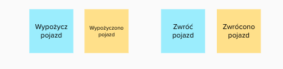
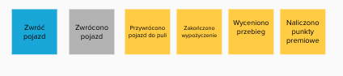

# Event Storming

## Materiały do przeanalizowania 
- 5 mitów dookoła EventStormingu - https://youtu.be/16j70vlOg5s
- Strategiczne DDD - słabe strony - Łukasz Szydło 
- (26.) O perspektywach Being, Behaving, Becoming | Better Software Design
- (25.) O modelu i modelowaniu ze Sławkiem Sobótką | Better Software Design
- Umiejętności miękkie Storming Troppera https://youtu.be/0uGzB8xp2ag
- Katalog Quick Win Question
```
' Mariusz Wojcik Today at 9:16 AM
@[Team] Mariusz Gil w prelekcji “5 minut dookoła eventstormingu” w pewnym momencie mówisz że należy sięgnąć do “Katalogu Quick Win Questions” , czy zechciałbyś przybliżyć mi trochę co to dla Ciebie jest ? Może zdradziłbyś jak wygląda Twój katalog - chociaż w zarysie :wink: ? (edited)
Jak zacząć budowanie sobie takiego katalogu pytań pomocniczych ? Czy to tylko z doświadczenia ?

[Team] Mariusz Gil  24 minutes ago
Zwykle dochodzi się do własnego zestawu pytań, ale można zacząć np. od podstawowych pytań Clean Questions.
https://cleanlanguage.co.uk/articles/articles/201/1/Polish-Clean-Questions/Page1.html
Ich geneza jest inna niż modelowanie oprogramowania, ale trochę z nich wykorzystuję podczas stormingu.

Trochę takich pytań będzie w module 9 LF, a pojawiają się też w kilku odcinkach podcastu. Np. tu https://bettersoftwaredesign.pl/episodes/26 i tu https://bettersoftwaredesign.pl/episodes/25
cleanlanguage.co.uk
Polish Clean Questions
Clean Language of David Grove, translated into Polish by Bozena Pie&#347;kiewicz The Centre for Clean Language and Symbolic Modelling
```

## Mity na temat ES
- ES jest prosty
- ES jest uniwersalny i da się go stosować w każdej domenie
- Instrukcja ES -jej zastosowanie doprowadzi nas do celu 

## Big Picture
### Fazy Big Picture
Składa się na nią kilka faz:
- Definiowanie celu
- Chaotyczna eksploracja
- Oś czasu
- Identyfiacja aktorów i systemów emitujących zdarzenia
- Opowieść (od początku do końca)
- Retrospektywa (analiza od końca do początku)
- Identyfikacja ryzyk

### Znaczenie języka Ubiquitous Language
**TODO: https://bettersoftwaredesign.pl/episodes/3**
**3. O różnych odmianach Ubiquitous Language z Łukaszem Szydło**

### Rodzaje zdarzeń


## Gdy sesja "nie idzie" - czyli czego się wystrzegać

**TODO - analiza DNA CONF - Strategiczne DDD - słabe strony - Łukasz Szydło**

### Sesja staje się nieprzewidywalna, improwizowana

Może się zdarzyć że na warsztat zostają zaproszone osoby które nie powinny być zaproszone, ponieważ modelowany 
fragment w ogóle ich nie dotyczy. Brak znajomości dziedziny może wprowadzać chaos. 

Facilitator musi zadbać o staranne zaplanowanie sesji. W głowie ma mieć obraz sesji. Być może będzie to wymagało 
dodatkowych analiz, przyjrzeniu się organizacji. Być może należy podjąć decyzję o pocięciu sesji na mniejsze kawałki,
ale musi się to stać przed sesją, musi być przewidywalne. 
Do zakresu sesji musi być dopasowana grupa uczestników. Należy bardzo uważać bo wykluczając jakąś grupę można stracić
możliwość odkrycia jakiegoś powiązania. Przy podziale można patrzeć na streamy w organizacji, podział organizacyjny 
itp. 

### Ekspert domenowy a użytkownik systemu

Często mylimy rolę eksperta domenowego od roli wykonawcy procesu.

W przypadku wykonawcy procesu , nie będącego ekspertem następujące zdarzenia


stanowią jego istotę. 

W przypadku prawdziwego eksperta tak nie jest. Ekspert jest w stanie stwierdzić co się dzieje pod spodem.

Sesja jest kosztem , czas wielu ludzi kosztuje, jeśli w jej wyniku powstaną zdarzenia typu "Wyświetlono 
formularz" , "Wprowadzono dane"
to jest ona bardzo nieefektywna. Zdarzenia są nic nie wnoszące, nie mówią o tym jak przebiega proces.
Są one szumem.

Osiągnięto efekt odwrotny od zamierzonego. Poniesiono koszt, a nie uzyskano spodziewanego wyniku.

**Jak przekonać ekspertów do komunikowania się zdarzeniami domenowymi?**

Zasada 5 razy dlaczego (Five Whys) - Wyobraźmy sobie sytuację że nie mamy systemu, a posiadamy jedynie zeszyty
w których zapisujemy informacje. Teraz spróbujmy sobie wyobrazić że czynności wykonywane przez system zapisujemy
na kartce. Zapis typu "Wyświetlono formularz" jest bez sensu, tylko zmarnowanie czasu. 
Zapis powinien być uzasadniony. Zadajmy sobie pytanie "DLACZEGO zdecydowałem się na zapis właśnie tego",
jak zamierzam to później wykorzystać. Po co mam przechowywać tą właśnie informację w systemie. 
Zwykle gdy coś zapisuję , to w przyszłości będę chciał odczytać.
Możemy zadawać pytania do eksperta dlaczego chcesz to zapisać , wtedy próbując odnieść się do powodu naturalnie 
wychwytywane będą te zdarzenia które są domenowe, bo tylko one mają swój powód.

### Domena nie zostaje zeksplorowana wystarczająco głęboko - pozorna symetria

Czasem się zdarza, że sesja pozornie przebiega dobrze, ale w jej wyniku otrzymujemy wiele miejsc gdzie komenda jest
po prostu "kopią" zdarzenia, a pomiędzy nimi nic się nie dzieje. Może być to przejaw dwóch sytuacji, albo mamy 
docczynienia z CRUDem albo domena nie została wystarczająco dokładnie zeksplorowana. Mamy do czynienia z problemem
pozornej symetrii pomiędzy commandem a eventem. 



Należy zadać sobie pytanie czy jeżeli mam takie zdarzenie "Zwrócono pojazd" to co zmienia się w moim systemie, czy
tylko flaga pojazu ? A może coś więcej, a jeśli tak to co ? A może samo zwrócenie jest kompletnie niważne, tylko
ważne jest to co znajduje się po tym.
Jeśli zmian jest wiele, to należy zrobić jedno zdarzenie per zmiana
Czy biznes dla którego realizujemy projekt jest zainteresowany samym zdarzeniem zwrócenia pojazdu czy też jego 
skutkami/konsekwencjami? W większości przypadków ważne są właśnie konsekwencje. 

Wtedy powinniśmy doprowadzić do następującego stanu:




### Zastosowanie ES do rozwiązania nieadekwatnego problemu

W przypadku :
- domen płytkich
- problemów algorytmicznych
- problemów związanych z obróbką danych

Nie należy stosować ES. Cały ceremoniał będzie niepotrzebnym kosztem. 

Facilitator musi zadbać o swój TOOLBOX. Powinien znać techniki wykraczające poza ES. Gdy w wyniku
eksploracji okazuje się że rozwiązywany problem jest niapasujący do ES należy zrezygnować z ES.
Sam event storming nie jest celem. Celem jest modelowanie dziedziny, ES jest tylko narzędziem. 

Najlepszym działaniem jest zmiana narzędzia na adekwatne do zastanego lub odkrytego problemu bo 
celem jest rozwiązanie. 

### Problemy z chronologią

Na tym etapie następuje porządkowanie zdarzeń - nadanie im chronologii. Czasami jest to bardzo trudne, wtedy dopuszczone są techniki wspomagające (strategie sortowania) .

Wśród nich wyróżnić można:

- Pivotal events ( zdarzenia kluczowe - Pivotal Events) - technika ta polega na wyróżnieniu kilku zdarzeń, które 
wydają się najważniejsze. Inne zdarzenia s ą porządkowane względem nich, po zadaniu pytania czy to zdarzenie stało się wcześniej , czy później względem najbliszego PE.

- Swimlanes - na tablicy wprowadza się linie poziome tworzące osobne obszary reprezentująca poszczególne działy i 
jednostki organizacjyjne biorące udział w procesie. Zdarzenia układane są chronologicznie, ale przyporządkowywane do odpowiedniej partycji.

- Milestones - strategia ta polega na określeniu na tablicy określonych punktów w czasie np. (1 rok wcześniej, 3mce 
wcześniej, itd.) - zdarzenia układa si ę umiejscawiając je w "przypuszczlnej" ramce.

- Chapters - technika ta polega na wykorzystaniu opowiadanej historii. Dzieli się ją na rozdziały i w ich ramach porządkowane są zdarzenia.

- Strategia mieszana - zgodnie z ideą ES nic nie jest stałe i strategie można dowolnie ze sobą mieszać.

- W przypadku systemu rekrutacji zastosowana została technika Pivotal Events. Każde ze zdarzeń kluczowych wyróżnione 
zostało pionową kreską ułatwiająca umiejscawianie zdarzeń poprzedzających lub następnych.


### Wyszukiwanie niespójności - opowieść (od początku do końca) i retrospektywa (analiza od końca do początku) - jak to zrobić ?

Co jeśli mamy poczucie że odkryty proces jest niespójny , czegoś brakuje, albo przeczuwamy zaburzoną  chronologię?

Można zastosować dwie techniki , opowieść i retrospektywa.

Celem kolejnego kroku jest dalsze uspójnienie dosyć dobrze już zarysowanego procesu. Służy temu analiza kolejnych zdarzeń , a środkiem wyrazu jest opowieść snuta najpierw od początku do końca, a następnie od końca do początku. W wyniku tych opowieści ujawniają się miejsca niespójne, w których jedno zdarzenie nie wynika z drugigo. Jest to znak że należy dokładniej przyjrzeć się temu fragmentowi procesu. Może okazać się że coś nieprawidłowo zostało osadzone w czasie, albo że czegoś brakuje.

Narracja od początku do końca pokazuje że coś co wydawało się już spójne w wielu miejscach wymaga doprecyzowania. 

Jeszcze ciekawsze efekty przynosi narracja odwrotna. Tutaj przy każdym głośno wypowiedzianym zdarzeniu należy zastanowić się czy jest ono bezpośrednim następstwem poprzedniego.
Bardzo ważnym elementem towarzyszącym jest powszechna dyskusja.


### Katalog Quick Win Questions

**TODO MWO: OPRACOWAC na podstawie poniższych materiałów :**  


  
