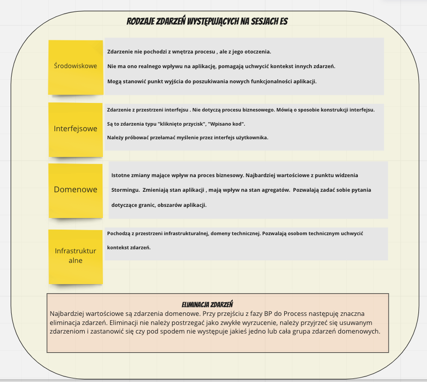
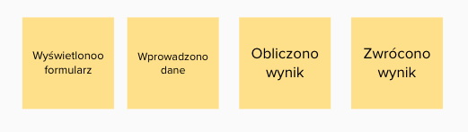

# Event Storming

## Materiały do przeanalizowania 
- 5 mitów dookoła EventStormingu - https://youtu.be/16j70vlOg5s
- Strategiczne DDD - słabe strony - Łukasz Szydło 
- 26. O perspektywach Being, Behaving, Becoming | Better Software Design
- 25. O modelu i modelowaniu ze Sławkiem Sobótką | Better Software Design

## Mity na temat ES
- ES jest prosty
- ES jest uniwersalny i da się go stosować w każdej domenie
- Instrukcja ES -jej zastosowanie doprowadzi nas do celu 

## Big Picture
### Fazy Big Picture
Składa się na nią kilka faz:
- Definiowanie celu
- Chaotyczna eksploracja
- Oś czasu
- Identyfiacja aktorów i systemów emitujących zdarzenia
- Opowieść (od początku do końca)
- Retrospektywa (analiza od końca do początku)
- Identyfikacja ryzyk

### Znaczenie języka Ubiquitous Language
**TODO: https://bettersoftwaredesign.pl/episodes/3**
**3. O różnych odmianach Ubiquitous Language z Łukaszem Szydło**

### Rodzaje zdarzeń

## Gdy sesja "nie idzie"

**TODO - analiza DNA CONF - Strategiczne DDD - słabe strony - Łukasz Szydło**

### Ekspert domenowy a użytkownik systemu

Często mylimy rolę eksperta domenowego od roli wykonawcy procesu.
W przypadku wykonawcy procesu , nie będącego ekspertem następujące zdarzenia

stanowią jego istotę. 

W przypadku prawdziwego eksperta tak nie jest. Ekspert jest w stanie stwierdzić co się dzieje pod spodem.

### Nieskuteczność sesji

Sesja jest kosztem , czas wielu ludzi kosztuje, jeśli w jej wyniku powstaną zdarzenia typu

to jest ona bardzo nieefektywna. Zdarzenia są nic nie wnoszące, nie mówią o tym jak przebiega proces.
Są one szumem.

Osiągnięto efekt odwrotny od zamierzonego. 

### Zastosowanie ES do rozwiązania nieadekwatnego problemu

W przypadku :
- domen płytkich
- problemów algorytmicznych
- problemów związanych z obróbką danych

Nie należy stosować ES. Cały ceremoniał będzie niepotrzebnym kosztem. 

### Problemy z chronologią

Na tym etapie następuje porządkowanie zdarzeń - nadanie im chronologii. Czasami jest to bardzo trudne, wtedy dopuszczone są techniki wspomagające (strategie sortowania) .

Wśród nich wyróżnić można:

- Pivotal events ( zdarzenia kluczowe - Pivotal Events) - technika ta polega na wyróżnieniu kilku zdarzeń, które 
wydają się najważniejsze. Inne zdarzenia s ą porządkowane względem nich, po zadaniu pytania czy to zdarzenie stało się wcześniej , czy później względem najbliszego PE.

- Swimlanes - na tablicy wprowadza się linie poziome tworzące osobne obszary reprezentująca poszczególne działy i 
jednostki organizacjyjne biorące udział w procesie. Zdarzenia układane są chronologicznie, ale przyporządkowywane do odpowiedniej partycji.

- Milestones - strategia ta polega na określeniu na tablicy określonych punktów w czasie np. (1 rok wcześniej, 3mce 
wcześniej, itd.) - zdarzenia układa si ę umiejscawiając je w "przypuszczlnej" ramce.

- Chapters - technika ta polega na wykorzystaniu opowiadanej historii. Dzieli się ją na rozdziały i w ich ramach porządkowane są zdarzenia.

- Strategia mieszana - zgodnie z ideą ES nic nie jest stałe i strategie można dowolnie ze sobą mieszać.

- W przypadku systemu rekrutacji zastosowana została technika Pivotal Events. Każde ze zdarzeń kluczowych wyróżnione 
zostało pionową kreską ułatwiająca umiejscawianie zdarzeń poprzedzających lub następnych.

### Wyszukiwanie niespójności - opowieść (od początku do końca) i retrospektywa (analiza od końca do początku) - jak to zrobić ?

Celem kolejnego kroku jest dalsze uspójnienie dosyć dobrze już zarysowanego procesu. Służy temu analiza kolejnych zdarzeń , a środkiem wyrazu jest opowieść snuta najpierw od początku do końca, a następnie od końca do początku. W wyniku tych opowieści ujawniają się miejsca niespójne, w których jedno zdarzenie nie wynika z drugigo. Jest to znak że należy dokładniej przyjrzeć się temu fragmentowi procesu. Może okazać się że coś nieprawidłowo zostało osadzone w czasie, albo że czegoś brakuje.

Narracja od początku do końca pokazuje że coś co wydawało się już spójne w wielu miejscach wymaga doprecyzowania. 

Jeszcze ciekawsze efekty przynosi narracja odwrotna. Tutaj przy każdym głośno wypowiedzianym zdarzeniu należy zastanowić się czy jest ono bezpośrednim następstwem poprzedniego.
Bardzo ważnym elementem towarzyszącym jest powszechna dyskusja.

### Katalog Quick Win Questions

**TODO MWO: OPRACOWAC na podstawie poniższych materiałów :**  

' Mariusz Wojcik Today at 9:16 AM
@[Team] Mariusz Gil w prelekcji “5 minut dookoła eventstormingu” w pewnym momencie mówisz że należy sięgnąć do “Katalogu Quick Win Questions” , czy zechciałbyś przybliżyć mi trochę co to dla Ciebie jest ? Może zdradziłbyś jak wygląda Twój katalog - chociaż w zarysie :wink: ? (edited)
3 replies

Mariusz Wojcik  40 minutes ago
chodzi mi o ten moment: https://youtu.be/16j70vlOg5s?t=2237
Jak zacząć budowanie sobie takiego katalogu pytań pomocniczych ? Czy to tylko z doświadczenia ?

[Team] Mariusz Gil  24 minutes ago
Zwykle dochodzi się do własnego zestawu pytań, ale można zacząć np. od podstawowych pytań Clean Questions. 
https://cleanlanguage.co.uk/articles/articles/201/1/Polish-Clean-Questions/Page1.html 
Ich geneza jest inna niż modelowanie oprogramowania, ale trochę z nich wykorzystuję podczas stormingu.

Trochę takich pytań będzie w module 9 LF, a pojawiają się też w kilku odcinkach podcastu. Np. tu https://bettersoftwaredesign.pl/episodes/26 i tu https://bettersoftwaredesign.pl/episodes/25
cleanlanguage.co.uk
Polish Clean Questions
Clean Language of David Grove, translated into Polish by Bozena Pie&#347;kiewicz The Centre for Clean Language and Symbolic Modelling
Better Software DesignBetter Software Design
26. O perspektywach Being, Behaving, Becoming | Better Software Design
    "There are only two hard things in Computer Science: cache invalidation and naming things" - nie pierwszy raz wracam w podkaście do słów Phila Karltona, a zapewne także i nie ostatni. Gdy coś raz zostanie nazwane, zwłaszcza niefortunnie, często bardzo trudno się od tej nazwy uwolnić. Tym razem chciałbym więc zwrócić uwagę na to, co i jak możemy przeanalizować w naszym projekcie zanim zaczniemy nazywać poszczególne jego elementy i obiekty. Mowa tu oczywiście o perspektywach, dzięki którym możemy poznać jak coś wygląda, jak się zachowuje, a czasem dodatkowo czym innym się staje i kiedy. Technika wyjątkowo prosta w użyciu i jednocześnie zaskakująco skuteczna.
    Better Software DesignBetter Software Design
25. O modelu i modelowaniu ze Sławkiem Sobótką | Better Software Design
    Architektura i model - dwa proste słowa, które bez kontekstu w zasadzie nie wiadomo co oznaczają. Dziś, wspólnie z moim gościem, Sławkiem Sobótką postaramy się porozmawiać właśnie o modelu i sposobach modelowania. W końcu cytując Sławka "model jest wszystkim czego potrzebujesz"... Ale tym razem postaramy się cofnąć trochę czas i wrócić myślami aż do 2013 roku, gdy hasło EventStorming nie było jeszcze znane. W tym odcinku wspólnie ze Sławkiem rozmawiamy o: - technikach modelowania domenowego - kontekście modelu i powiązanym z nim językiem - prostych sposobach na utrwalanie pozyskanej wiedzy
    '
