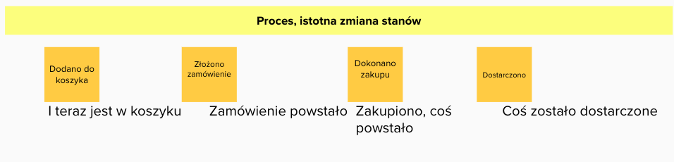
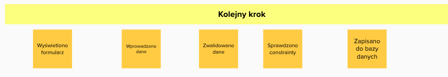
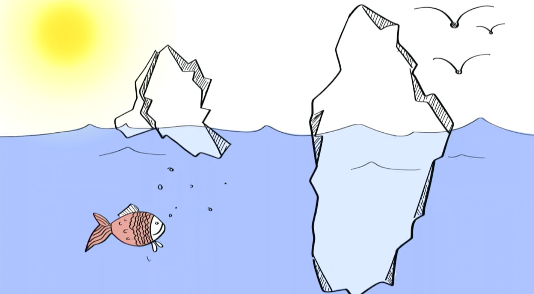

# Event Storming

## Materiały do przeanalizowania

- 5 mitów dookoła EventStormingu - https://youtu.be/16j70vlOg5s
- Strategiczne DDD - słabe strony - Łukasz Szydło
- (26.) O perspektywach Being, Behaving, Becoming | Better Software Design
- (25.) O modelu i modelowaniu ze Sławkiem Sobótką | Better Software Design
- Umiejętności miękkie Storming Troppera https://youtu.be/0uGzB8xp2ag
- Katalog Quick Win Question

## Mity na temat ES

- ES jest prosty
- ES jest uniwersalny i da się go stosować w każdej domenie
- Instrukcja ES -jej zastosowanie doprowadzi nas do celu

## Big Picture

### Fazy Big Picture

Składa się na nią kilka faz:

- Definiowanie celu
- Chaotyczna eksploracja
- Oś czasu
- Identyfiacja aktorów i systemów emitujących zdarzenia
- Opowieść (od początku do końca)
- Retrospektywa (analiza od końca do początku)
- Identyfikacja ryzyk

### Znaczenie języka Ubiquitous Language

**TODO: https://bettersoftwaredesign.pl/episodes/3**
**3. O różnych odmianach Ubiquitous Language z Łukaszem Szydło**

### Zmiana stanu vs kolejny etap

Należy zwrócić uwagę by odkrywać istotne procesy biznesowe i nie mylić ich z kolejnymi krokami przetwarzania.

#### Proces domenowy



#### Rejestracja kolejnych kroków




### Rodzaje zdarzeń


### Techniki pomocnicze przy odkrywaniu domeny

#### Metoda 5 Whys

```
5 Whys to technika Sakichi Toyody z lat 30 ubiegłego wieku. 
Proste ale czasem mocno bolesne narzędzie i do sedna zwykle dociera się przy 3-4 powtórzeniu :wink:
 https://www.mindtools.com/pages/article/newTMC_5W.htm
mindtools.commindtools.com
5 Whys: Getting to the Root of a Problem Quickly
5 Whys, or 5Y, is a powerful tool for getting to the root cause of a problem, and an effective way to expose weaknesses in your systems or processes.
```

#### Katalog pytań Quick Win

```
' Mariusz Wojcik Today at 9:16 AM
@[Team] Mariusz Gil w prelekcji “5 minut dookoła eventstormingu” w pewnym momencie mówisz że należy sięgnąć do “Katalogu Quick Win Questions” , czy zechciałbyś przybliżyć mi trochę co to dla Ciebie jest ? Może zdradziłbyś jak wygląda Twój katalog - chociaż w zarysie :wink: ? (edited)
Jak zacząć budowanie sobie takiego katalogu pytań pomocniczych ? Czy to tylko z doświadczenia ?

[Team] Mariusz Gil  24 minutes ago
Zwykle dochodzi się do własnego zestawu pytań, ale można zacząć np. od podstawowych pytań Clean Questions.
https://cleanlanguage.co.uk/articles/articles/201/1/Polish-Clean-Questions/Page1.html
Ich geneza jest inna niż modelowanie oprogramowania, ale trochę z nich wykorzystuję podczas stormingu.

Trochę takich pytań będzie w module 9 LF, a pojawiają się też w kilku odcinkach podcastu. Np. tu https://bettersoftwaredesign.pl/episodes/26 i tu https://bettersoftwaredesign.pl/episodes/25
cleanlanguage.co.uk
Polish Clean Questions
Clean Language of David Grove, translated into Polish by Bozena Pie&#347;kiewicz The Centre for Clean Language and Symbolic Modelling

```

## Gdy sesja "nie idzie" - czyli czego się wystrzegać

### Sesja staje się nieprzewidywalna, improwizowana

Może się zdarzyć że na warsztat zostają zaproszone osoby które nie powinny być zaproszone, ponieważ modelowany fragment
w ogóle ich nie dotyczy. Brak znajomości dziedziny może wprowadzać chaos.

Facilitator musi zadbać o staranne zaplanowanie sesji. W głowie ma mieć obraz sesji. Być może będzie to wymagało
dodatkowych analiz, przyjrzeniu się organizacji. Być może należy podjąć decyzję o pocięciu sesji na mniejsze kawałki,
ale musi się to stać przed sesją, musi być przewidywalne. Do zakresu sesji musi być dopasowana grupa uczestników. Należy
bardzo uważać bo wykluczając jakąś grupę można stracić możliwość odkrycia jakiegoś powiązania. Przy podziale można
patrzeć na streamy w organizacji, podział organizacyjny itp.

### Ekspert domenowy a użytkownik systemu

Często mylimy rolę eksperta domenowego od roli wykonawcy procesu.

W przypadku wykonawcy procesu , nie będącego ekspertem następujące zdarzenia


stanowią jego istotę.

W przypadku prawdziwego eksperta tak nie jest. Ekspert jest w stanie stwierdzić co się dzieje pod spodem.

Sesja jest kosztem , czas wielu ludzi kosztuje, jeśli w jej wyniku powstaną zdarzenia typu "Wyświetlono formularz" , "
Wprowadzono dane"
to jest ona bardzo nieefektywna. Zdarzenia są nic nie wnoszące, nie mówią o tym jak przebiega proces. Są one szumem.

Osiągnięto efekt odwrotny od zamierzonego. Poniesiono koszt, a nie uzyskano spodziewanego wyniku.

Ten sam system widziany z perspektywy użytkownika i eksperta domenowego



**Scenariusz 1:  Książkowa zawierucha**
Nowy projekt, branża wydawnicza, mamy proces wydawania książki, był robiony w excelu. Zapraszamy przedstawicieli
wielu działów. Każdy przykleja karteczki. Pojwia się zalew karteczek - prawdziwa eksplozja. Domena wydaje się bardzo 
skomplikowana, a w rzeczywistości czujemy że jest prosta. Domena się nie ujawniła.

**Scenariusz 2: Rekrutacyjny flow**
Branża outsourcingowa. Projekt podobny do pierwszego, przepisywany z excela do aplikacji, zaproszeni ludzie z 
biznesu. Sesja przebiega zupełnie inaczej ale zupełnie inna dynamika. Eventy prawidłowe, pojawiają się 
nazwy, subdomeny. W firmie były już procesy, osoby zaproszone znały je i były jednocześnie użytkownikami systemu. 
Domena była ewidentna.

**Scenariusz 3: jeden analityk i programiści** 
Nie było nikogo z biznesu. Storming wyszedł dobrze.  Analityk spędził wystarczająco dużo czasu na analizie i 
naprawdę znał biznes. Jeśli analityk jest osobą która zna domenę to może spokojnie zastępować biznes. Problem 
jest wtedy gdy analityk jest proxy do biznesu, nie dokonuje destylacji wiedzy, wtedy osiąga się stan podobny do 
scenariusza 1 ale ciężej jest to zidentyfikować bo wydaje nam się że mamy do czynienia z ekspertem.

Jaka jest różnica pomiędzy tymi sytuacjami ? Wszędzie obowiązywały te same reguły a wyniki bardzo różne. 

Okazało się że w pierwszym scenariuszu na spotkaniu byli użytkownicy systemu a nie eksperci domenowi. Były trzy 
działy które robiły to samo ale w różny sposób

Czasem zespół techniczny jest dobrym ekspertem domenowym.

Przykład :

1. Opis działania aplikacji do gry w bilard przez użytkownika : mnóstwo przykładów brzegowych, gdy bila uderzy tu to 
   odbije się i uderza w inne miejsce, jeśli trafi w następną bilę to robi się coś innego
2. Opis działania aplikacji do gry w bilard przez eksperta : fizyka zjawiska, reguła uniwersalna, kąt odbicia równy 
   jest kątowi padania

Aplikacja napisana według pierwszego scenariusza byłaby bardzo rozbudowana, niepotrzebnie skomplikowana, pełna ifów 
obsługujących warunki brzegowe.

**Jeśli na spotkaniu mamy tylko użytkowników to my musimy stać się ekspertem domenowym**

**Jak przekonać ekspertów do komunikowania się zdarzeniami domenowymi?**

Zasada 5 razy dlaczego (Five Whys) - Wyobraźmy sobie sytuację że nie mamy systemu, a posiadamy jedynie zeszyty w których
zapisujemy informacje. Teraz spróbujmy sobie wyobrazić że czynności wykonywane przez system zapisujemy na kartce. Zapis
typu "Wyświetlono formularz" jest bez sensu, tylko zmarnowanie czasu. Zapis powinien być uzasadniony. Zadajmy sobie
pytanie "DLACZEGO zdecydowałem się na zapis właśnie tego", jak zamierzam to później wykorzystać. Po co mam przechowywać
tą właśnie informację w systemie. Zwykle gdy coś zapisuję , to w przyszłości będę chciał odczytać. Możemy zadawać
pytania do eksperta dlaczego chcesz to zapisać , wtedy próbując odnieść się do powodu naturalnie wychwytywane będą te
zdarzenia które są domenowe, bo tylko one mają swój powód.

### Domena nie zostaje zeksplorowana wystarczająco głęboko - pozorna symetria

Czasem się zdarza, że sesja pozornie przebiega dobrze, ale w jej wyniku otrzymujemy wiele miejsc gdzie komenda jest po
prostu "kopią" zdarzenia, a pomiędzy nimi nic się nie dzieje. Może być to przejaw dwóch sytuacji, albo mamy docczynienia
z CRUDem albo domena nie została wystarczająco dokładnie zeksplorowana. Mamy do czynienia z problemem pozornej symetrii
pomiędzy commandem a eventem.


Należy zadać sobie pytanie czy jeżeli mam takie zdarzenie "Zwrócono pojazd" to co zmienia się w moim systemie, czy tylko
flaga pojazu ? A może coś więcej, a jeśli tak to co ? A może samo zwrócenie jest kompletnie niważne, tylko ważne jest to
co znajduje się po tym. Jeśli zmian jest wiele, to należy zrobić jedno zdarzenie per zmiana Czy biznes dla którego
realizujemy projekt jest zainteresowany samym zdarzeniem zwrócenia pojazdu czy też jego skutkami/konsekwencjami? W
większości przypadków ważne są właśnie konsekwencje.

Wtedy powinniśmy doprowadzić do następującego stanu:


### Zastosowanie ES do rozwiązania nieadekwatnego problemu

W przypadku :

- domen płytkich
- problemów algorytmicznych
- problemów związanych z obróbką danych

Nie należy stosować ES. Cały ceremoniał będzie niepotrzebnym kosztem.

Facilitator musi zadbać o swój TOOLBOX. Powinien znać techniki wykraczające poza ES. Gdy w wyniku eksploracji okazuje
się że rozwiązywany problem jest niapasujący do ES należy zrezygnować z ES. Sam event storming nie jest celem. Celem
jest modelowanie dziedziny, ES jest tylko narzędziem.

Najlepszym działaniem jest zmiana narzędzia na adekwatne do zastanego lub odkrytego problemu bo celem jest rozwiązanie.

```
Mariusz Wojcik Feb 1st at 10:01 AM
Cześć, @[Team] Mariusz Gil w swojej prelekcji “5 mitów…” wspominasz że czasem startujemy z Big Picture 
i okazuje się że analiza procesowa nie nadaje się do rozwiązania danego problemu (bo np. domena jest zbyt uboga w biznes, 
proces jest rozległy ale płytki) że wtedy należy sięgnąć po inne metody. Czy mógłbyś zdradzić co masz w Toolboxie 
pod ręką na taką okazję ? Czy dobrym pomysłem jest wsparcie się projektem frontu

[Team] Mariusz Gil  2 months ago
@Mariusz Wojcik Czasem stosuję po prostu schemat blokowy, który pokazuje sposób wyliczania pewnych rzeczy, czasem diagram
 sekwencji dla pokazania komunikacji, czasem diagram maszyny stanów, etc. Do tego wszelkiej maści rysunki i wizualizacje, 
 bo czasem jeden dobry rysunek nagle powoduje a-ha moment u wszystkich.
W dzisiejszym odcinku Better Software Design rozmawiam z Michałem Michalukiem na temat wykorzystania BDD do analizy problemu,
 i to też jest dobry tool w toolboksie. Zachęcam, aby posłuchać Michała, bo mądrego to zawsze dobrze posłuchać 
 :slightly_smiling_face:Michał też zresztą mówi, jak stosuje podejście BDD na sesjach ES i 
 jaki ma z tego efekt https://bettersoftwaredesign.pl/episodes/32
Co do wspierania się projektem frontu, to zdarzało mi się tak robić. 
Trzeba oczywiście uważać, że jeśli ten front powstał mocno “przed” głębszą analizą, to może być trudno się od niego uwolnić i zakwestionować sensowność pewnych decyzji. A czasem trzeba coś wywalić z niego, dodać w innym miejscu, etc.
Z EventModelingiem nie mam zbyt dużego doświadczenia aby się wypowiadać, bo w mojej aktualnej ocenie jest to mocno uproszczony PLES, który nie pokazuje tego, co jest dla mnie istotne :wink: Ale może nie zrozumiałem jeszcze tej techniki do końca :slightly_smiling_face:
Better Software DesignBetter Software Design
32. O Behaviour-Driven Development z Michałem Michalukiem | Better Software Design
Do tej pory w rozmowach przewijał się temat EventStormingu, jako narzędzia do rozpoznawania 
domeny. Dzisiejszy gość, Michał Michaluk, pokazuje jak używa podejścia Behaviour-Driven Development, przy którego pomocy pozyskuje i systematyzuje wiedzę domenową. W dzisiejszym odcinku będzie można posłuchać m.in. o: - krótkiej historii BDD, - stosowaniu tej techniki w praktyce, - narzędziach wykorzystujących to podejście, - praktycznych wskazówkach od Michała, aby taki warsztat był dla wszystkich uczestników wartościowy.
```

### Problemy z chronologią

Na tym etapie następuje porządkowanie zdarzeń - nadanie im chronologii. Czasami jest to bardzo trudne, wtedy dopuszczone
są techniki wspomagające (strategie sortowania) .

Wśród nich wyróżnić można:

- Pivotal events ( zdarzenia kluczowe - Pivotal Events) - technika ta polega na wyróżnieniu kilku zdarzeń, które wydają
  się najważniejsze. Inne zdarzenia s ą porządkowane względem nich, po zadaniu pytania czy to zdarzenie stało się
  wcześniej , czy później względem najbliszego PE.

- Swimlanes - na tablicy wprowadza się linie poziome tworzące osobne obszary reprezentująca poszczególne działy i
  jednostki organizacjyjne biorące udział w procesie. Zdarzenia układane są chronologicznie, ale przyporządkowywane do
  odpowiedniej partycji.

- Milestones - strategia ta polega na określeniu na tablicy określonych punktów w czasie np. (1 rok wcześniej, 3mce
  wcześniej, itd.) - zdarzenia układa si ę umiejscawiając je w "przypuszczlnej" ramce.

- Chapters - technika ta polega na wykorzystaniu opowiadanej historii. Dzieli się ją na rozdziały i w ich ramach
  porządkowane są zdarzenia.

- Strategia mieszana - zgodnie z ideą ES nic nie jest stałe i strategie można dowolnie ze sobą mieszać.

- W przypadku systemu rekrutacji zastosowana została technika Pivotal Events. Każde ze zdarzeń kluczowych wyróżnione
  zostało pionową kreską ułatwiająca umiejscawianie zdarzeń poprzedzających lub następnych.

### Wyszukiwanie niespójności - opowieść (od początku do końca) i retrospektywa (analiza od końca do początku) - jak to zrobić ?

Co jeśli mamy poczucie że odkryty proces jest niespójny , czegoś brakuje, albo przeczuwamy zaburzoną chronologię?

Można zastosować dwie techniki , opowieść i retrospektywa.

Celem kolejnego kroku jest dalsze uspójnienie dosyć dobrze już zarysowanego procesu. Służy temu analiza kolejnych
zdarzeń , a środkiem wyrazu jest opowieść snuta najpierw od początku do końca, a następnie od końca do początku. W
wyniku tych opowieści ujawniają się miejsca niespójne, w których jedno zdarzenie nie wynika z drugigo. Jest to znak że
należy dokładniej przyjrzeć się temu fragmentowi procesu. Może okazać się że coś nieprawidłowo zostało osadzone w
czasie, albo że czegoś brakuje.

Narracja od początku do końca pokazuje że coś co wydawało się już spójne w wielu miejscach wymaga doprecyzowania.

Jeszcze ciekawsze efekty przynosi narracja odwrotna. Tutaj przy każdym głośno wypowiedzianym zdarzeniu należy zastanowić
się czy jest ono bezpośrednim następstwem poprzedniego. Bardzo ważnym elementem towarzyszącym jest powszechna dyskusja.


  
